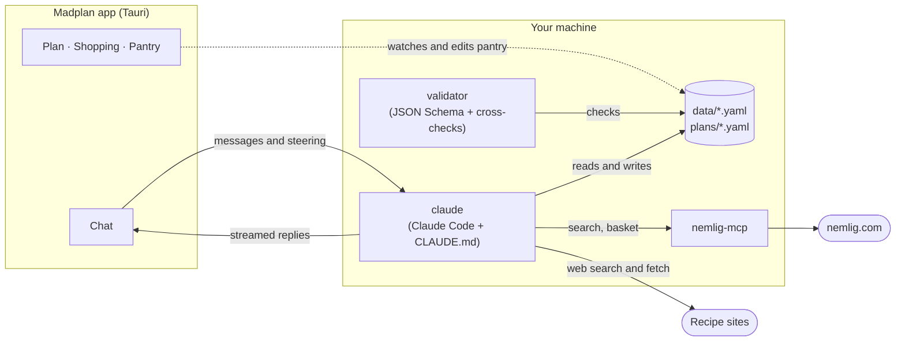

# Madplan

**A meal planning agent for Danish households.** Madplan plans your week around what you like, what's in season in Denmark and what's on sale at [nemlig.com](https://www.nemlig.com), then fills your nemlig basket for you. You check out yourself.

It's a small desktop app (Tauri + Svelte) with [Claude Code](https://docs.claude.com/en/docs/claude-code) as the agent behind it. Your household's preferences, pantry and weekly plans are plain YAML files on your own machine.

> **Status: early, run-from-source only.** No installers or prebuilt binaries yet, and Claude Code is the only supported agent. You build and run it locally, with Claude Code installed and logged in.

## What it does

- **Gets to know your household first.** On first start, the agent interviews you for about five minutes: who you cook for (adults, children's ages), diet and allergies, dislikes, favourite cuisines, how your week looks (cook daily or batch-cook, packed lunches, time on weeknights), budget, delivery day, and what matters when you shop (price, organic, Danish, quality, convenience…). It saves your answers as your profile and sets up your recipe sources and pantry. You can send photos of your shelves and it reads the labels.
- **Plans the week.** Dinners (plus packed lunches, breakfasts or snacks if you want them), built around Danish seasonal produce and this week's nemlig offers. Recipes come from real recipe sites (Danish and English) that it searches and reads, adapted to your household.
- **Builds the shopping list.** Quantities for your household minus what's already in your pantry, priced on nemlig by your own priorities (cheapest, organic, Danish, budget ranges, whatever you chose) and this week's sale prices, checked against your budget.
- **Fills the basket when you say so.** It never checks out or pays; you choose the delivery slot and pay on nemlig.com.
- **The app** shows the plan, the shopping list with budget and savings, and an editable pantry, next to the chat with the agent. You can steer the agent while it works.

## Requirements

- **[Claude Code](https://docs.claude.com/en/docs/claude-code/setup)**, installed and logged in (`claude` on your `PATH`). Planning uses your Claude subscription or API usage.
- **A nemlig.com account.**
- **[Rust](https://rustup.rs)** (stable) and **[Node.js](https://nodejs.org)** 20+ to build the app.
- **[uv](https://docs.astral.sh/uv/)** and Python 3.11+ for the nemlig MCP server.
- **Tauri's system dependencies** for your OS: see [Tauri prerequisites](https://v2.tauri.app/start/prerequisites/). On Debian/Ubuntu (including WSL2):
  ```bash
  sudo apt install libwebkit2gtk-4.1-dev build-essential curl wget file libxdo-dev libssl-dev libayatana-appindicator3-dev librsvg2-dev
  ```
- Optional: `pdftotext` (poppler-utils) if you want the agent to use cookbooks you own as PDFs.

## Getting started

### 1. Clone, with the nemlig submodule

```bash
git clone --recurse-submodules https://github.com/malpou/madplan.git
cd madplan
```

Already cloned without `--recurse-submodules`? Run `git submodule update --init`.

### 2. Set up the nemlig MCP server

[`nemlig-mcp`](https://github.com/malpou/nemlig-mcp) is how the agent searches products and fills your basket. Install its dependencies:

```bash
(cd nemlig-mcp && uv sync)
```

Then store your nemlig login where the server can find it (outside the repo, readable only by you):

```bash
mkdir -p ~/.config/nemlig
cat > ~/.config/nemlig/login.json <<'EOF'
{"username": "you@example.com", "password": "your-password"}
EOF
chmod 600 ~/.config/nemlig/login.json
```

The server can't place orders or read payment cards, and it redacts your name, address, phone, email and door code before anything reaches the agent.

### 3. Trust the folder in Claude Code (once)

```bash
claude
```

Accept the "trust this folder" prompt, then exit with `/exit`. Claude Code ignores this project's settings until the folder is trusted, and without them the agent can't validate files, search recipe sites or use nemlig.

### 4. Build and run the app

```bash
npm install
npx tauri dev
```

The first build takes a few minutes while Rust compiles. Then the Madplan window opens. Click **Get started** and answer the agent's questions; when your profile and pantry are saved, ask it to plan next week.

Keep the terminal open; closing it closes the app.

### Prefer the terminal?

Everything also works without the app: run `claude` in the repo and say hi. The agent follows the same instructions (`CLAUDE.md`), starting with the interview.

## How it works



- **The agent** is Claude Code running in this folder, steered by [`CLAUDE.md`](CLAUDE.md) (interview, food principles, sales rules, workflow). The app keeps one `claude` process per chat and streams its output; messages you send while it works are delivered as steering.
- **Data** is YAML, checked against the schemas in [`schemas/`](schemas). The agent runs the validator after every edit; the app also validates in the background when files change and sends any errors back to the agent.
- **Your data stays local.** `data/`, `plans/` and `logs/` are git-ignored.

### Files

| Path | What |
|---|---|
| `data/profile.yaml` | Your household: people, diet, preferences, routine, budget, delivery (created by the interview) |
| `data/pantry.yaml` | What you have at home (interview, then the Pantry tab or the agent) |
| `data/seasonal.yaml` | Danish seasonal produce by month (copied from `defaults/`) |
| `data/sources.yaml` | Your recipe sites and cookbooks, with your ratings (picked from `defaults/sources.yaml`) |
| `plans/YYYY-Www.yaml` | One plan per ISO week, including the shopping list and budget |
| `defaults/` | Starting points shipped with the repo |
| `schemas/` | JSON Schemas (in YAML) for every file, plus a complete example plan |
| `cookbooks/` | PDFs of cookbooks you own, for the agent to search (git-ignored) |
| `logs/telemetry.jsonl` | Local debug log: agent turns, tool calls, validation, errors |

## Using it week to week

1. Ask the agent to plan the coming week (1–2 days before your delivery day). It asks who's home, training, cravings.
2. Review the draft in the **Plan** tab; ask for changes in the chat, then approve.
3. It builds and prices the shopping list (**Shopping** tab). Adjust, then confirm.
4. It fills your nemlig basket. Pick a delivery slot and pay on nemlig.com.
5. After delivery it updates the pantry; at the end of the week, rate the dishes so it learns what you like.

Change your setup any time by telling the agent ("we're vegetarian now", "our son started school and needs madpakker").

## Development

```bash
cargo test --workspace               # validator + app backend tests
cargo run -q -p validator            # validate every data/plan file
cargo run -q -p validator -- plans/2026-W42.yaml
npm run build                        # frontend only
```

- `validator/`: Rust library + CLI that validates the YAML against the schemas and cross-checks plans (dish references, budget sums, sale prices and campaign dates).
- `src-tauri/`: the app backend: agent process management, file watching, pantry writes, telemetry.
- `ui/`: Svelte 5 frontend.
- `nemlig-mcp/`: git submodule ([malpou/nemlig-mcp](https://github.com/malpou/nemlig-mcp), a fork of [kraenhansen/nemlig-mcp](https://github.com/kraenhansen/nemlig-mcp)).

Set `MADPLAN_ROOT=/path/to/data/repo` to point a built app at a different folder.

## Troubleshooting

- **The agent can't validate, fetch recipes or use nemlig.** The folder isn't trusted yet. See step 3.
- **The window opens but stays blank (Linux/WSL).** Start it with `WEBKIT_DISABLE_DMABUF_RENDERER=1 npx tauri dev`.
- **nemlig tools fail to start.** Check `uv sync` ran inside `nemlig-mcp/` and that `~/.config/nemlig/login.json` exists.
- **Something else went wrong.** Look at `logs/telemetry.jsonl`; errors have `"level":"error"`, e.g. `jq -c 'select(.level=="error")' logs/telemetry.jsonl | tail`.

## Disclaimer

Madplan is an unofficial hobby project and is not affiliated with or endorsed by nemlig.com. Prices and offers come from nemlig at the time of planning; always check your basket before you pay.

## License

[MIT](LICENSE)
